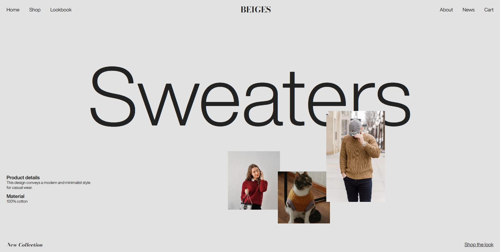

# 🧥 Modern Landing Page – BEIGES

A minimalist and **modern fashion landing page** designed for the brand **BEIGES**, featuring layered product imagery, elegant typography, and a neutral color palette.  
Built with **HTML** and **CSS**, this project highlights layout positioning, custom fonts, and a clean UI aesthetic.

---

## ✨ Features

- 🧭 **Modern and minimalist** full-page layout
- 🖼️ **Layered product images** with z-index stacking
- 🧵 **Custom typography** using _Helvetica Now Display_ and _Bodoni Moda_
- 🎨 Subtle grayscale palette and visual hierarchy
- 💎 **Favicon set** and manifest for professional branding

---

## 🌐 Live Demo / Review

You can view the live landing page here:  
👉 [Live Demo](https://harsh-codes-hub.github.io/Modern-Landing-Page-TASK3/)

Explore the **BEIGES Modern Landing Page** directly in your browser.

---

## 🗂️ File Structure

```
Modern-Landing-Page-TASK3/
│
├── index.html # Main HTML structure for landing page
├── style.css # Stylesheet with typography, layout, and image layering
├── preview.webp # Preview image of the webpage
│
├── /favicon/ # Icons and web manifest
│ ├── favicon-16x16.png
│ ├── favicon-32x32.png
│ ├── apple-touch-icon.png
│ ├── android-chrome-192x192.png
│ ├── android-chrome-512x512.png
│ ├── favicon.ico
│ └── site.webmanifest
│
├── /fonts/ # Local custom fonts
│ ├── BodoniModa-VariableFont_opsz,wght.woff2
│ ├── HelveticaNowDisplay-Regular.woff2
│ ├── HelveticaNowDisplay-Bold.woff2
│ ├── HelveticaNowDisplay-Black.woff2
│ ├── HelveticaNowDisplay-Light.woff2
│ ├── HelveticaNowDisplay-Medium.woff2
│ └── ... (other Helvetica Now Display weights & italics)
│
└── README.md # Project documentation
```

---

## 💻 Usage

1. **Clone the repository:**
   ```bash
   git clone https://github.com/harsh-codes-hub/Modern-Landing-Page-TASK3.git
   ```
2. **Navigate to the project directory:**

   ```bash
   cd Modern-Landing-Page-TASK3
   ```

3. **Open the project in your browser**
   ```
   open index.html
   ```
   or simply double-click on **index.html**

---

## 🧠 Learning Highlights

- Practiced layered image positioning with z-index
- Implemented flex-based header navigation
- Integrated local custom fonts with multiple weights
- Learned font-face management and fallbacks
- Built a modern minimalist interface with consistent color tones

---

## 📸 Preview

A modern fashion landing page featuring large typography, layered sweater product images, and clean layout.



---

## 🛠️ Built With

- HTML5
- CSS3
- Custom Fonts: Helvetica Now Display, Bodoni Moda

---

## 👨‍💻 Author

**Cohort 2.0 – Batch Task 3 Submission**  
Created by **Harsh Gajrani** *(Harsh Codes Hub)*  
Part of the **Cohort 2.0 batch at Sheryians Coding School**

---

_⭐ If you found this project helpful or inspiring, please consider giving it a star on GitHub!_
